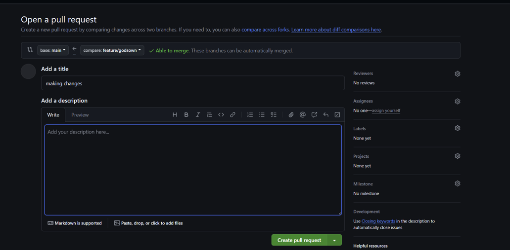
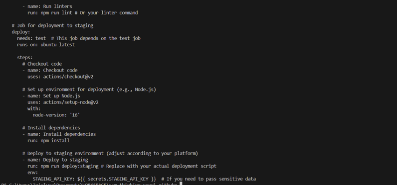
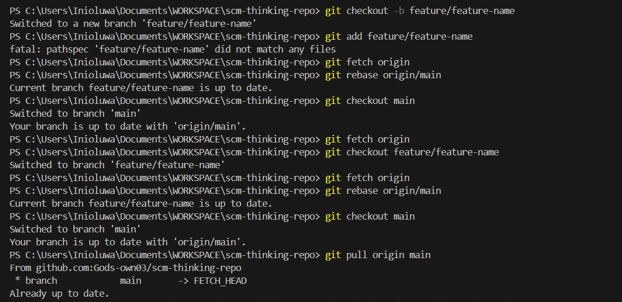

# Task 1: Evaluate Different SCM Tools

## Differences Between Centralized (SVN) and Distributed (Git) Version Control Systems

1.Centralized Version Control Systems (SVN) Overview
Centralized System: In SVN, there is a single central repository where all code is stored. Developers check out a working copy, make changes, and then commit those changes to the central repository.

- Working Model: All developers rely on the central repository for history and synchronization.

- Pros of SVN:

    Simple Setup: Easy to set up and maintain for smaller teams.

    Centralized Control: Clear visibility of who is working on what, and central control for version history.

- Cons of SVN:

    Single Point of Failure: If the central repository goes down, developers cannot commit or sync changes.

    Offline Limitations: Developers can’t work offline unless they have already checked out the code.

    Scaling Issues: As teams grow and the repository grows in size, performance can degrade.

2.Distributed Version Control Systems (Git) Overview
Distributed System: In Git, every developer has a full copy of the repository, including the complete version history. Developers work on their local copies and push/pull changes to/from the central repository.

- Working Model: Developers can commit and branch locally without requiring immediate access to the central repository.

- Pros of Git:

- Work Offline: Developers can work and commit locally, even without network access.

- Faster Performance: Git is optimized for speed, especially with large repositories and multiple branches.

- Branching and Merging: Git supports efficient branching and merging, allowing teams to work on feature branches and integrate them without disrupting the main branch.

- No Single Point of Failure: Since every developer has a full repository, if the central repository goes down, it doesn’t halt the team's workflow.

- Cons of Git:

- Learning Curve: Git has a steeper learning curve than SVN, especially for developers new to distributed systems.

- Complexity in Management: With the ability to create many branches, managing these can get complicated, particularly in large teams or when coordinating releases.

 Key Differences:

- Repository Access: SVN uses a central repository, whereas Git allows developers to have their own local copy.

- Work Offline: Git allows offline work, SVN requires network access to commit.

- Performance and Scalability: Git performs better with larger repositories and large-scale teams.

- Branching Model: Git’s branching and merging capabilities are far more robust and efficient than SVN.

- Flexibility: Git offers a more flexible approach to managing development workflows (feature branching, GitFlow, GitHub flow, etc.).

## Evaluate the Advantages and Challenges of Using Git in a Distributed Environment

 ### Advantages of Using Git in a Distributed Environment:

 - Scalability and Flexibility:

    Git is highly scalable, supporting small to large projects with ease. It’s ideal for teams of various sizes, particularly in geographically distributed environments.

    With Git, multiple workflows are supported (e.g., GitFlow, GitHub Flow), giving flexibility in how the team manages releases, hotfixes, and features.

- Offline Work:

    Developers can work offline with a full local copy of the repository, which is crucial for teams across multiple time zones or working with unreliable network connectivity.

    They can commit locally, resolve conflicts, and later push changes to the central server when they're back online.

- Improved Collaboration with Branching and Merging:

    Git’s powerful branching and merging capabilities make it ideal for collaborative development. Developers can work on features or bug fixes in isolated branches without affecting the main codebase.

    Pull requests (in platforms like GitHub, GitLab, or Bitbucket) enable code reviews before merging, helping ensure high code quality.

- Resilience and Redundancy:

    Since every developer has a full copy of the repository, Git offers redundancy. If the central repository becomes unavailable, developers can continue working, and when the central repository comes back online, changes can be pushed.

- Automation with CI/CD:

    Git integrates seamlessly with continuous integration and continuous deployment (CI/CD) tools, automating the process of building, testing, and deploying code changes. This improves code quality and reduces manual intervention.

    ### Challenges of Using Git in a Distributed Environment:

- Steep Learning Curve:

    Developers who are familiar with SVN may face challenges transitioning to Git due to the different way Git handles commits, branches, merges, and rebases.

    Proper training will be required to help developers get up to speed with Git.

- Managing Remote Repositories:

    Git’s decentralized nature means managing multiple remotes (origin, upstream) and branches can be complex. Careful planning of workflows and repository management is essential.

- Merge Conflicts:

    While Git has strong merge capabilities, managing merge conflicts, especially in a large, distributed team, can be time-consuming and prone to error. Clear communication and frequent syncing are important to avoid large-scale conflicts.

- Repository Size:

## MY REPORT

### Introduction:

- The transition from SVN (Subversion) to Git marks a shift from a centralized version control system (CVCS) to a distributed version control system (DVCS). In SVN, all developers rely on a central repository to check out, commit, and manage code changes, which can create bottlenecks and dependency on a single point of failure. Git, on the other hand, allows each developer to have a full copy of the repository on their local machine, enabling them to work independently, commit changes offline, and later sync with the central repository.

- This transition is particularly important for geographically distributed teams, as Git enhances collaboration, supports efficient branching and merging, and provides more flexibility in how developers work. The move to Git is aimed at improving scalability, workflow flexibility, and team autonomy while reducing the challenges of working in a centralized system. However, this shift also requires a learning curve and adjustments to workflows, especially in managing branches, merges, and remote repositories.

Here are key reasons why choosing the right VCS is important for a distributed team:

1. Collaboration and Communication
A VCS should support seamless collaboration, allowing developers in different locations to work on the same project simultaneously without interfering with each other's work. The ability to easily share changes, review code, and manage different versions of the codebase is essential to ensure smooth teamwork and avoid conflicts.

2. Flexibility in Workflow
The right VCS enables flexibility in managing different development workflows, such as feature branching, release management, and bug fixing. A distributed VCS like Git offers powerful branching and merging capabilities, allowing developers to work on isolated features or fixes independently, which is critical for distributed teams working asynchronously.

3. Offline Capabilities
Distributed teams, especially those working across different time zones or with varying internet connectivity, need a VCS that supports offline work. Git, being a distributed system, allows developers to commit changes locally, even when they’re not connected to the central repository. This reduces dependency on continuous internet access and ensures that work can proceed without interruption.

4. Scalability
As teams grow and the project evolves, the chosen VCS must be able to scale efficiently. Distributed systems like Git are optimized for large-scale development and large codebases, handling multiple contributors and branches without sacrificing performance. This scalability ensures that the system remains efficient as the team expands and the project becomes more complex.

5. Resilience and Redundancy
For distributed teams, having a resilient system is vital. A distributed VCS like Git ensures redundancy by storing complete copies of the repository on each developer’s machine. If the central repository becomes unavailable, developers can still work locally, reducing downtime and ensuring that progress isn’t halted.

6. Security and Access Control
Ensuring that sensitive code is protected and that team members have the appropriate access is critical. The right VCS should provide robust access control mechanisms, allowing fine-grained permissions and secure authentication, especially in environments with multiple contributors and different levels of access.

7. Integration with CI/CD and Automation Tools
Modern development practices rely heavily on automation for continuous integration, testing, and deployment. A VCS that integrates well with CI/CD tools is essential for streamlining these processes. Git, with its widespread support across CI/CD platforms, ensures automated builds, tests, and deployments, improving code quality and reducing manual effort.

### Comparison of Centralized vs Distributed Version Control Systems:

When transitioning from SVN (Subversion) to Git, it’s important to understand how each system works and their respective benefits and challenges, especially in a distributed team environment.

1. Subversion (SVN) – Centralized Version Control

How SVN Works:

- SVN operates on a centralized version control model, meaning there is a single, central repository where all code and its history are stored.

- Developers check out a working copy of the repository, make changes locally, and then commit those changes back to the central repository. This creates a central source of truth for the project.

- The repository tracks all revisions of the code, allowing developers to update their local copies to match the latest version and resolve conflicts if needed when committing changes.

Benefits of SVN:

- Simplicity: SVN is relatively easy to set up and use. It’s a straightforward approach to version control, making it ideal for smaller teams or simpler workflows.

- Centralized Control: There is a clear and single source of truth (the central repository), making it easier to track changes and manage the repository.

- Clear Version History: The centralized nature allows easy tracking of revisions, and everyone has access to the same history, which simplifies the understanding of code changes.

Challenges of SVN:

- Single Point of Failure: Since SVN relies on a central repository, if the server goes down, all development activities (commit, checkout, update) are halted.

- Limited Offline Work: Developers must have access to the central repository to check out code or commit changes. If they are offline or disconnected, they cannot work effectively.

- Scalability Issues: As teams grow or repositories become larger, the performance of SVN can degrade. A centralized system can become a bottleneck with many developers accessing the same repository at once.

- Branching Limitations: SVN has less efficient branching and merging capabilities compared to Git, making managing multiple features or parallel development more difficult.

2. Git – Distributed Version Control

How Git Works:

- Git operates on a distributed version control model, where each developer has a complete copy of the entire repository, including its full history.

- Developers can work locally on their own copy of the repository, making changes, committing them, and even branching independently without affecting the central repository.

- Changes are pushed to or pulled from the central repository when necessary, and Git’s merging system handles combining the work of multiple developers from different branches.

Benefits of Git:

- Offline Work: Since each developer has a full copy of the repository, they can work offline. This allows for flexibility, especially for distributed teams or teams in locations with unreliable internet access.

- Faster Operations: Git operates more quickly than SVN, especially when it comes to committing changes, switching branches, and handling large repositories. Since developers work locally, there’s no need to communicate with the central repository for every operation.

- Powerful Branching and Merging: Git's branching and merging capabilities are far superior to SVN. Developers can create feature branches, experiment, and merge them with minimal disruption to the main branch (usually main or master). Git makes it easier to manage parallel development, which is crucial for larger teams working on multiple features simultaneously.

- Distributed Nature – No Single Point of Failure: Since every developer has a full copy of the repository, Git is more resilient. If the central repository is unavailable, developers can continue to work on their local copies and synchronize changes later.

- Integration with CI/CD: Git integrates seamlessly with continuous integration (CI) and continuous deployment (CD) tools, allowing automated builds, tests, and deployments.

Challenges of Git:

- Steep Learning Curve: Git is more complex than SVN, especially for new users. Understanding concepts like branches, merges, rebases, and remote repositories can be challenging for developers who are new to distributed version control systems.

- Complexity in Workflow Management: Managing multiple remotes, branches, and merges can become complicated, especially with large teams. A well-organized branching strategy (like GitFlow or GitHub Flow) is crucial to prevent chaos in the repository.

- Potential for Large Repositories: While Git performs well with large codebases, very large repositories or repositories with large binaries can become cumbersome. This may require additional strategies like git-lfs (Large File Storage) to handle binary assets efficiently.

- Merge Conflicts: While Git provides powerful tools for resolving merge conflicts, dealing with large and frequent merges can still be cumbersome and require extra effort, particularly in large, distributed teams.

.png>)

## Task 2: Implement Git Workflows for a Team Project

Here are the steps i took to ensure implementing Git Workflows for the Team Project

## Ensuring I'm in the main branch

## Pulling latest changes from main branch

## Creating a new branch from main

## Running Git add and committing my changes

## Pushing my changes to remote repo

## Making a pull request

## Code reviews

## Merging PR to main branch

## Keeping main branch up to date

## How this work facilitate collaboration

- Work independently
- Efficient reviews
- Integration Testing 
- Flexible collaboration 

## Task 3: Automate Code Quality and Deployment

Here are the steps I took to automate code quality and development

## Creating a github workflow file 

## Creating a New YAML Workflow File ionside github workflow file

## Defining the Workflow in the YAML File

## Configuring GitHub Secrets

## Pushing Workflow File to GitHub

## Task 4: Enforce Security Best Practices

### How I set up best security practices for my Git repository

#### Via SSH

#### Branch protection

## Explaining how this ensures the security and integrity of the codebase

Enforcing **commit signing** and enabling **branch protection** are essential practices for ensuring the **security** and **integrity** of a codebase in a collaborative software development environment. Here's how each of these measures helps protect the codebase:

### 1. **Commit Signing**
Commit signing ensures that the **author** of a commit is **authenticated**, and the commit itself has not been **tampered with** during transmission. This is achieved by attaching a **cryptographic signature** to each commit. When using **GPG** or **SSH keys** to sign commits, the process provides the following benefits:

#### **A. Authentication of the Commit Author**
- **Verifiable Identity**: Signed commits prove that the commit was made by a specific user, verified through their private key. This ensures that only the person with access to a specific private key could have signed the commit, thus preventing impersonation.
- **Trustworthiness**: Since the signature can be verified against a public key (which is often shared with GitHub or other hosting platforms), collaborators can be confident that the commit was made by the user associated with the key.
  
#### **B. Integrity of the Commit**
- **Tamper-Proof**: A signed commit ensures the **integrity** of the code. If an attacker or unauthorized user tries to modify a commit after it’s signed, the signature will become invalid, alerting others that the commit has been tampered with.
- **Non-repudiation**: Since the commit is signed with a private key, the author cannot later deny making the commit. This prevents malicious users from claiming that they were not responsible for potentially harmful changes.

#### **C. Visibility into Commit History**
- **Auditing**: By requiring commit signatures, the repository maintains a clear audit trail. Any commit that has been altered or is unsigned can be flagged, providing transparency into the actions of contributors.

#### **D. Secure Collaboration**
- By enforcing signed commits, the integrity of the codebase remains intact, especially in open-source projects or large teams where multiple contributors push code to shared branches. Commit signing reduces the risk of **man-in-the-middle attacks**, where a malicious actor could inject malicious code into the codebase.

---

### 2. **Branch Protection**
Branch protection rules help safeguard important branches (such as `main` or `master`) by enforcing restrictions that ensure only valid code is merged. Some key protections include:

#### **A. Prevention of Direct Pushes to Protected Branches**
- **No Unauthorized Changes**: By preventing direct pushes to important branches, you ensure that changes can only be made through **pull requests**. This prevents anyone from bypassing review processes and introducing potentially harmful code directly.
- **Reduces Risk of Mistakes**: Developers must create pull requests, which ensures that changes undergo a review process before being merged. This reduces the chances of inadvertent mistakes or bugs being introduced directly to the main codebase.

#### **B. Requirement for Pull Request Reviews**
- **Code Review**: Protecting branches by requiring at least one review before merging ensures that changes are properly evaluated by another developer. This review process serves as a form of **peer verification**, ensuring that the code follows best practices, is free from bugs, and does not introduce security vulnerabilities.
- **Collaborative Quality Control**: Pull request reviews enable a more thorough examination of new code and ensure it meets quality standards, making it less likely that faulty or insecure code gets merged into the main branch.

#### **C. Require Status Checks to Pass**
- **Continuous Integration (CI) Validation**: Requiring status checks to pass ensures that automated tests (e.g., unit tests, integration tests, or linters) are executed before any changes are merged. This helps ensure that the new code does not break existing functionality or introduce errors.
- **Early Detection of Problems**: With CI checks in place, errors can be detected early, and problematic code can be rejected before it reaches production.

#### **D. Enforcing Signed Commits**
- **Signed Commit Enforcement**: Branch protection rules can enforce the requirement for signed commits, ensuring that only authenticated and verifiable code is merged into the protected branch.
- **Protection Against Code Injection**: This reduces the risk of malicious actors injecting unsigned or unverified code into the repository. It helps ensure that code contributions are legitimate, especially when contributing from external sources or contributors.

---

### 3. **Overall Security Benefits**
Together, **commit signing** and **branch protection** provide several key benefits to the security and integrity of your codebase:

- **Prevents Malicious Code Injections**: By ensuring that all commits are signed and reviewed, the likelihood of an attacker injecting malicious code or unauthorized changes into the codebase is significantly reduced.
- **Accountability**: With signed commits, there’s a clear and verifiable record of who made each change. This helps in tracking down the source of any problems or vulnerabilities that arise.
- **Code Quality Assurance**: Branch protection ensures that all code changes are reviewed and validated before they are merged, ensuring a higher standard of code quality and reducing the chance of introducing bugs or vulnerabilities.
- **Operational Security**: By enforcing these controls, you protect critical branches from being inadvertently or maliciously modified. Only validated, reviewed, and approved code can make its way into the main codebase.

## Task 5: Handling a Real-World Git Challenge

### I stimulated a conflict btw 2 developers

### Resolving conflict

### Updating the team’s Git workflow

- YAML file:
  

